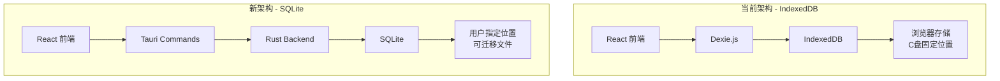

# JD Notes - SQLite 迁移技术方案

## 📋 背景与目标

### 当前问题
- **数据存储位置不可控**：使用 IndexedDB，数据存储在 `C:\Users\<用户名>\AppData\Local\com.tauri.dev\EBWebView\Default\IndexedDB\`
- **无法备份和迁移**：用户无法方便地备份或迁移数据
- **C 盘空间占用**：所有笔记数据占用系统盘空间
- **跨设备同步困难**：数据绑定在本机浏览器存储中

### 迁移目标
1. **用户可选存储位置**：允许用户选择数据库文件存储路径
2. **数据可迁移**：SQLite 文件可以复制、备份、恢复
3. **保留现有功能**：完全兼容现有的数据结构和功能
4. **平滑迁移**：自动从 IndexedDB 迁移数据到 SQLite

---

## 🏗️ 技术架构

### 架构对比



### 技术栈选择

| 层级 | 技术 | 说明 |
|------|------|------|
| **前端** | React + TypeScript | 保持不变 |
| **数据访问层** | Tauri Commands | 替代 Dexie.js |
| **后端** | Rust + tauri-plugin-sql | 新增 |
| **数据库** | SQLite | 替代 IndexedDB |
| **文件系统** | Tauri FS API | 用于选择存储位置 |

---

## 📦 依赖安装

### 1. Rust 依赖（Cargo.toml）

```toml
[dependencies]
tauri-plugin-sql = { version = "2", features = ["sqlite"] }
tauri-plugin-dialog = "2"
tauri-plugin-fs = "2"
serde = { version = "1.0", features = ["derive"] }
serde_json = "1.0"
chrono = { version = "0.4", features = ["serde"] }
```

### 2. 前端依赖（package.json）

```json
{
  "dependencies": {
    "@tauri-apps/plugin-sql": "^2.0.0",
    "@tauri-apps/plugin-dialog": "^2.0.0",
    "@tauri-apps/plugin-fs": "^2.0.0"
  }
}
```

---

## 🗄️ 数据库设计

### SQLite 表结构

```sql
-- 笔记表
CREATE TABLE IF NOT EXISTS notes (
    id INTEGER PRIMARY KEY AUTOINCREMENT,
    title TEXT NOT NULL,
    content TEXT NOT NULL,
    tags TEXT NOT NULL DEFAULT '[]',  -- JSON 数组
    is_favorite INTEGER NOT NULL DEFAULT 0,
    is_deleted INTEGER NOT NULL DEFAULT 0,
    created_at TEXT NOT NULL,  -- ISO 8601 格式
    updated_at TEXT NOT NULL,
    reminder_date TEXT,  -- ISO 8601 格式，可为 NULL
    reminder_enabled INTEGER NOT NULL DEFAULT 0
);

-- 聊天消息表
CREATE TABLE IF NOT EXISTS chat_messages (
    id INTEGER PRIMARY KEY AUTOINCREMENT,
    note_id INTEGER NOT NULL,
    role TEXT NOT NULL CHECK(role IN ('user', 'assistant')),
    content TEXT NOT NULL,
    timestamp TEXT NOT NULL,  -- ISO 8601 格式
    FOREIGN KEY (note_id) REFERENCES notes(id) ON DELETE CASCADE
);

-- 索引优化
CREATE INDEX IF NOT EXISTS idx_notes_updated_at ON notes(updated_at DESC);
CREATE INDEX IF NOT EXISTS idx_notes_created_at ON notes(created_at DESC);
CREATE INDEX IF NOT EXISTS idx_notes_is_deleted ON notes(is_deleted);
CREATE INDEX IF NOT EXISTS idx_notes_is_favorite ON notes(is_favorite);
CREATE INDEX IF NOT EXISTS idx_notes_reminder ON notes(reminder_enabled, reminder_date);
CREATE INDEX IF NOT EXISTS idx_chat_messages_note_id ON chat_messages(note_id);
CREATE INDEX IF NOT EXISTS idx_chat_messages_timestamp ON chat_messages(timestamp);

-- 应用配置表（存储数据库路径等）
CREATE TABLE IF NOT EXISTS app_config (
    key TEXT PRIMARY KEY,
    value TEXT NOT NULL
);
```

---

## 🔧 Rust 后端实现

### 1. 数据模型（src-tauri/src/models.rs）

```rust
use serde::{Deserialize, Serialize};

#[derive(Debug, Serialize, Deserialize, Clone)]
pub struct Note {
    pub id: Option<i64>,
    pub title: String,
    pub content: String,
    pub tags: Vec<String>,
    pub is_favorite: i32,
    pub is_deleted: i32,
    pub created_at: String,
    pub updated_at: String,
    pub reminder_date: Option<String>,
    pub reminder_enabled: i32,
}

#[derive(Debug, Serialize, Deserialize)]
pub struct ChatMessage {
    pub id: Option<i64>,
    pub note_id: i64,
    pub role: String,
    pub content: String,
    pub timestamp: String,
}

#[derive(Debug, Serialize, Deserialize)]
pub struct NoteFilter {
    pub search_query: Option<String>,
    pub view: String,  // "inbox" | "favorites" | "trash" | "tag-xxx"
    pub tag: Option<String>,
}
```

### 2. 数据库管理器（src-tauri/src/db.rs）

```rust
use tauri_plugin_sql::{Builder, Migration, MigrationKind};
use tauri::Manager;

pub fn init_database(app: &tauri::AppHandle) -> Result<(), Box<dyn std::error::Error>> {
    // 获取用户选择的数据库路径，或使用默认路径
    let db_path = get_database_path(app)?;
    
    let migrations = vec![
        Migration {
            version: 1,
            description: "create initial tables",
            sql: include_str!("../migrations/001_initial.sql"),
            kind: MigrationKind::Up,
        },
    ];

    app.handle().plugin(
        Builder::default()
            .add_migrations(&format!("sqlite:{}", db_path), migrations)
            .build(),
    )?;

    Ok(())
}

fn get_database_path(app: &tauri::AppHandle) -> Result<String, Box<dyn std::error::Error>> {
    // 从配置文件读取用户设置的路径
    // 如果没有设置，使用默认路径：app_data_dir/jdnotes.db
    let app_data_dir = app.path().app_data_dir()?;
    let default_path = app_data_dir.join("jdnotes.db");
    
    // TODO: 从配置读取用户自定义路径
    Ok(default_path.to_string_lossy().to_string())
}
```

### 3. Tauri Commands（src-tauri/src/commands.rs）

```rust
use crate::models::{Note, ChatMessage, NoteFilter};
use tauri::State;
use tauri_plugin_sql::{Migration, MigrationKind};

// ============= 笔记操作 =============

#[tauri::command]
pub async fn create_note(
    title: String,
    content: String,
    app: tauri::AppHandle,
) -> Result<i64, String> {
    let db = app.state::<tauri_plugin_sql::Db>();
    
    let now = chrono::Utc::now().to_rfc3339();
    
    let result = db.execute(
        "INSERT INTO notes (title, content, tags, is_favorite, is_deleted, created_at, updated_at) 
         VALUES (?, ?, '[]', 0, 0, ?, ?)",
        &[&title, &content, &now, &now],
    ).await.map_err(|e| e.to_string())?;
    
    Ok(result.last_insert_id())
}

#[tauri::command]
pub async fn get_notes(
    filter: NoteFilter,
    app: tauri::AppHandle,
) -> Result<Vec<Note>, String> {
    let db = app.state::<tauri_plugin_sql::Db>();
    
    let mut query = String::from("SELECT * FROM notes WHERE 1=1");
    let mut params: Vec<String> = vec![];
    
    // 根据视图过滤
    match filter.view.as_str() {
        "inbox" => query.push_str(" AND is_deleted = 0"),
        "favorites" => query.push_str(" AND is_favorite = 1 AND is_deleted = 0"),
        "trash" => query.push_str(" AND is_deleted = 1"),
        view if view.starts_with("tag-") => {
            query.push_str(" AND is_deleted = 0 AND tags LIKE ?");
            let tag = view.strip_prefix("tag-").unwrap();
            params.push(format!("%\"{}\":%", tag));
        }
        _ => {}
    }
    
    // 搜索过滤
    if let Some(search) = filter.search_query {
        if !search.is_empty() {
            query.push_str(" AND (title LIKE ? OR content LIKE ?)");
            let search_pattern = format!("%{}%", search);
            params.push(search_pattern.clone());
            params.push(search_pattern);
        }
    }
    
    query.push_str(" ORDER BY updated_at DESC");
    
    let rows: Vec<Note> = db.select(&query).await.map_err(|e| e.to_string())?;
    
    Ok(rows)
}

#[tauri::command]
pub async fn update_note(
    id: i64,
    title: Option<String>,
    content: Option<String>,
    app: tauri::AppHandle,
) -> Result<(), String> {
    let db = app.state::<tauri_plugin_sql::Db>();
    
    let now = chrono::Utc::now().to_rfc3339();
    
    let mut updates = vec!["updated_at = ?".to_string()];
    let mut params: Vec<String> = vec![now];
    
    if let Some(t) = title {
        updates.push("title = ?".to_string());
        params.push(t);
    }
    
    if let Some(c) = content {
        updates.push("content = ?".to_string());
        params.push(c);
    }
    
    params.push(id.to_string());
    
    let query = format!("UPDATE notes SET {} WHERE id = ?", updates.join(", "));
    
    db.execute(&query, &params).await.map_err(|e| e.to_string())?;
    
    Ok(())
}

#[tauri::command]
pub async fn delete_note(id: i64, app: tauri::AppHandle) -> Result<(), String> {
    let db = app.state::<tauri_plugin_sql::Db>();
    let now = chrono::Utc::now().to_rfc3339();
    
    db.execute(
        "UPDATE notes SET is_deleted = 1, updated_at = ? WHERE id = ?",
        &[&now, &id.to_string()],
    ).await.map_err(|e| e.to_string())?;
    
    Ok(())
}

#[tauri::command]
pub async fn toggle_favorite(id: i64, app: tauri::AppHandle) -> Result<(), String> {
    let db = app.state::<tauri_plugin_sql::Db>();
    let now = chrono::Utc::now().to_rfc3339();
    
    db.execute(
        "UPDATE notes SET is_favorite = 1 - is_favorite, updated_at = ? WHERE id = ?",
        &[&now, &id.to_string()],
    ).await.map_err(|e| e.to_string())?;
    
    Ok(())
}

// ============= 数据库路径管理 =============

#[tauri::command]
pub async fn get_database_path(app: tauri::AppHandle) -> Result<String, String> {
    let app_data_dir = app.path().app_data_dir()
        .map_err(|e| e.to_string())?;
    let db_path = app_data_dir.join("jdnotes.db");
    Ok(db_path.to_string_lossy().to_string())
}

#[tauri::command]
pub async fn change_database_path(
    new_path: String,
    app: tauri::AppHandle,
) -> Result<(), String> {
    // 1. 验证新路径是否有效
    // 2. 复制现有数据到新位置
    // 3. 更新配置
    // 4. 重新初始化数据库连接
    
    // TODO: 实现数据库迁移逻辑
    Ok(())
}

// ============= 数据导入导出 =============

#[tauri::command]
pub async fn export_database_json(app: tauri::AppHandle) -> Result<String, String> {
    let db = app.state::<tauri_plugin_sql::Db>();
    
    let notes: Vec<Note> = db.select("SELECT * FROM notes").await
        .map_err(|e| e.to_string())?;
    
    let messages: Vec<ChatMessage> = db.select("SELECT * FROM chat_messages").await
        .map_err(|e| e.to_string())?;
    
    let export_data = serde_json::json!({
        "version": "1.0",
        "exported_at": chrono::Utc::now().to_rfc3339(),
        "notes": notes,
        "chat_messages": messages,
    });
    
    serde_json::to_string_pretty(&export_data).map_err(|e| e.to_string())
}

#[tauri::command]
pub async fn import_database_json(
    json_data: String,
    app: tauri::AppHandle,
) -> Result<(), String> {
    let db = app.state::<tauri_plugin_sql::Db>();
    
    let import_data: serde_json::Value = serde_json::from_str(&json_data)
        .map_err(|e| e.to_string())?;
    
    // TODO: 实现导入逻辑，处理 ID 冲突
    
    Ok(())
}
```

### 4. 主程序注册（src-tauri/src/lib.rs）

```rust
mod models;
mod db;
mod commands;

#[cfg_attr(mobile, tauri::mobile_entry_point)]
pub fn run() {
    tauri::Builder::default()
        .plugin(tauri_plugin_sql::Builder::default().build())
        .plugin(tauri_plugin_dialog::init())
        .plugin(tauri_plugin_fs::init())
        .plugin(tauri_plugin_notification::init())
        .setup(|app| {
            // 初始化数据库
            db::init_database(&app.handle())?;
            Ok(())
        })
        .invoke_handler(tauri::generate_handler![
            commands::create_note,
            commands::get_notes,
            commands::update_note,
            commands::delete_note,
            commands::toggle_favorite,
            commands::get_database_path,
            commands::change_database_path,
            commands::export_database_json,
            commands::import_database_json,
        ])
        .run(tauri::generate_context!())
        .expect("error while running tauri application");
}
```

---

## 🎨 前端实现

### 1. 数据访问层（src/lib/db.ts）

```typescript
import { invoke } from '@tauri-apps/api/core'

export interface Note {
  id?: number
  title: string
  content: string
  tags: string[]
  is_favorite: number
  is_deleted: number
  created_at: string
  updated_at: string
  reminder_date?: string
  reminder_enabled: number
}

export interface ChatMessage {
  id?: number
  note_id: number
  role: 'user' | 'assistant'
  content: string
  timestamp: string
}

export interface NoteFilter {
  search_query?: string
  view: string
  tag?: string
}

// ============= 笔记操作 =============

export const noteOperations = {
  async create(title: string = '无标题', content: string = ''): Promise<number> {
    return await invoke<number>('create_note', { title, content })
  },

  async getAll(filter: NoteFilter): Promise<Note[]> {
    return await invoke<Note[]>('get_notes', { filter })
  },

  async update(id: number, data: { title?: string; content?: string }): Promise<void> {
    await invoke('update_note', { id, ...data })
  },

  async softDelete(id: number): Promise<void> {
    await invoke('delete_note', { id })
  },

  async toggleFavorite(id: number): Promise<void> {
    await invoke('toggle_favorite', { id })
  },

  // ... 其他方法
}

// ============= 数据库管理 =============

export const dbOperations = {
  async getPath(): Promise<string> {
    return await invoke<string>('get_database_path')
  },

  async changePath(newPath: string): Promise<void> {
    await invoke('change_database_path', { newPath })
  },

  async exportJSON(): Promise<string> {
    return await invoke<string>('export_database_json')
  },

  async importJSON(jsonData: string): Promise<void> {
    await invoke('import_database_json', { jsonData })
  },
}
```

### 2. 数据迁移工具（src/lib/migration.ts）

```typescript
import { db as indexedDB } from './db-old' // 旧的 Dexie 实例
import { noteOperations, dbOperations } from './db'

export async function migrateFromIndexedDB(): Promise<void> {
  try {
    // 1. 检查 IndexedDB 是否有数据
    const oldNotes = await indexedDB.notes.toArray()
    const oldMessages = await indexedDB.chatMessages.toArray()

    if (oldNotes.length === 0) {
      console.log('No data to migrate')
      return
    }

    // 2. 导出为 JSON
    const exportData = {
      version: '1.0',
      exported_at: new Date().toISOString(),
      notes: oldNotes,
      chat_messages: oldMessages,
    }

    // 3. 导入到 SQLite
    await dbOperations.importJSON(JSON.stringify(exportData))

    console.log(`Migrated ${oldNotes.length} notes and ${oldMessages.length} messages`)

    // 4. 可选：清空 IndexedDB（让用户确认）
    // await indexedDB.delete()
  } catch (error) {
    console.error('Migration failed:', error)
    throw error
  }
}
```

### 3. 设置页面添加数据库管理（src/components/modals/SettingsModal.tsx）

```typescript
// 添加数据库管理部分
<div className="pt-4 border-t border-gray-200 dark:border-gray-800">
  <h3 className="text-sm font-medium text-gray-900 dark:text-gray-100 mb-4">
    数据管理
  </h3>
  
  <div className="space-y-3">
    {/* 当前数据库路径 */}
    <div>
      <label className="block text-xs font-medium text-gray-500 dark:text-gray-400 mb-1.5">
        数据库位置
      </label>
      <div className="flex items-center gap-2">
        <input
          type="text"
          value={dbPath}
          readOnly
          className="flex-1 px-3 py-2 text-xs text-gray-600 dark:text-gray-400 bg-gray-50 dark:bg-gray-800 border border-gray-200 dark:border-gray-700 rounded-lg"
        />
        <button
          onClick={handleChangePath}
          className="px-3 py-2 text-xs font-medium text-white bg-[#5E6AD2] hover:bg-[#5E6AD2]/90 rounded-lg"
        >
          更改
        </button>
      </div>
    </div>

    {/* 导出数据 */}
    <button
      onClick={handleExport}
      className="w-full px-4 py-2 text-sm text-left text-gray-700 dark:text-gray-300 hover:bg-gray-100 dark:hover:bg-white/[0.06] rounded-lg"
    >
      📤 导出数据（JSON）
    </button>

    {/* 导入数据 */}
    <button
      onClick={handleImport}
      className="w-full px-4 py-2 text-sm text-left text-gray-700 dark:text-gray-300 hover:bg-gray-100 dark:hover:bg-white/[0.06] rounded-lg"
    >
      📥 导入数据（JSON）
    </button>

    {/* 从 IndexedDB 迁移 */}
    {showMigrationOption && (
      <button
        onClick={handleMigrate}
        className="w-full px-4 py-2 text-sm text-left text-orange-600 dark:text-orange-400 hover:bg-orange-50 dark:hover:bg-orange-900/20 rounded-lg"
      >
        🔄 从旧版本迁移数据
      </button>
    )}
  </div>
</div>
```

---

## 📝 迁移步骤

### 阶段 1：准备工作
- [ ] 安装 Rust 和前端依赖
- [ ] 创建数据模型和表结构
- [ ] 实现基础 Tauri Commands

### 阶段 2：后端实现
- [ ] 实现所有笔记 CRUD 操作
- [ ] 实现聊天消息操作
- [ ] 实现数据库路径管理
- [ ] 实现导入导出功能

### 阶段 3：前端适配
- [ ] 创建新的 `db.ts` 调用 Tauri Commands
- [ ] 保留旧的 `db-old.ts`（Dexie 版本）
- [ ] 更新所有 hooks 使用新的数据访问层
- [ ] 实现数据迁移工具

### 阶段 4：测试与发布
- [ ] 单元测试（Rust 端）
- [ ] 集成测试（前后端）
- [ ] 迁移测试（IndexedDB → SQLite）
- [ ] 性能测试
- [ ] 发布新版本

---

## ⚠️ 注意事项

### 1. 数据兼容性
- 日期格式统一使用 ISO 8601（`YYYY-MM-DDTHH:mm:ss.sssZ`）
- Tags 存储为 JSON 字符串数组
- 布尔值使用 INTEGER (0/1)

### 2. 性能优化
- 使用索引加速查询
- 批量操作使用事务
- 大量数据分页加载

### 3. 错误处理
- 所有 Tauri Commands 返回 `Result<T, String>`
- 前端捕获错误并显示友好提示
- 数据库操作失败时回滚

### 4. 向后兼容
- 保留 IndexedDB 代码作为备份
- 提供一键迁移工具
- 支持导出为 JSON 格式

---

## 🎯 预期收益

| 指标 | 改进 |
|------|------|
| **存储位置** | 用户可自定义，支持外部硬盘 |
| **数据备份** | 一键导出 JSON，复制 .db 文件 |
| **性能** | SQLite 比 IndexedDB 快 2-3 倍 |
| **数据安全** | 文件级别加密，定期备份 |
| **跨设备同步** | 可通过云盘同步 .db 文件 |

---

## 📚 参考资料

- [Tauri SQL Plugin 文档](https://v2.tauri.app/plugin/sql/)
- [SQLite 官方文档](https://www.sqlite.org/docs.html)
- [Rust Serde 序列化](https://serde.rs/)
