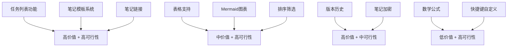

# JD Notes 功能优化建议方案

## 📋 项目现状分析

基于对代码库的全面审查，JD Notes 已经实现了以下核心功能：
- ✅ 富文本编辑器（TipTap + Markdown）
- ✅ AI 智能助手（右键菜单 + 侧栏对话）
- ✅ 日历视图（月/周/日视图 + 提醒功能）
- ✅ 笔记管理（收藏、标签、废纸篓）
- ✅ 主题切换（深色/浅色模式）
- ✅ 全局搜索（Cmd+K）

---

## 🎯 优化方向建议

### 一、核心体验优化（高优先级）

#### 1. **任务列表功能** ⭐⭐⭐
**现状问题**：
- 笔记只能记录文本内容，缺少任务管理能力
- 无法追踪待办事项的完成状态
- 缺少任务视图和统计

**优化方案**：
- 在编辑器中支持 Checkbox 任务列表（`- [ ]` 语法）
- 添加"任务"视图，聚合所有笔记中的待办事项
- 支持任务优先级标记（P0/P1/P2）
- 任务完成度统计和可视化

**技术实现**：
- 使用 TipTap 的 `TaskList` 和 `TaskItem` 扩展
- 数据库层面提取和索引任务项
- 新增任务聚合视图组件

---

#### 2. **笔记模板系统** ⭐⭐⭐
**现状问题**：
- 每次新建笔记都是空白，重复输入相同结构
- 缺少快速创建特定类型笔记的能力

**优化方案**：
- 内置常用模板（会议纪要、日记、项目计划、读书笔记等）
- 支持自定义模板并保存
- 新建笔记时可选择模板
- 模板变量支持（如 `{{date}}`、`{{time}}`）

**技术实现**：
- 数据库新增 `templates` 表
- 新建笔记对话框支持模板选择
- 模板变量解析引擎

---

#### 3. **笔记排序和筛选增强** ⭐⭐
**现状问题**：
- 笔记列表只能按更新时间排序
- 无法按创建时间、标题、收藏状态排序
- 缺少高级筛选（如：有提醒的笔记、有任务的笔记）

**优化方案**：
- 笔记列表头部添加排序下拉菜单
  - 按更新时间（默认）
  - 按创建时间
  - 按标题 A-Z
  - 按收藏优先
- 添加快速筛选器
  - 有提醒的笔记
  - 有未完成任务的笔记
  - 最近 7 天修改

**技术实现**：
- 在 [`useNotes.ts`](src/hooks/useNotes.ts) 中添加排序和筛选逻辑
- UI 层面在 [`NoteList.tsx`](src/components/layout/NoteList.tsx) 添加控制组件

---

#### 4. **笔记链接和双向链接** ⭐⭐⭐
**现状问题**：
- 笔记之间相互独立，无法建立关联
- 缺少知识网络的构建能力

**优化方案**：
- 支持 `[[笔记标题]]` 语法创建笔记链接
- 点击链接跳转到对应笔记
- 显示反向链接（哪些笔记引用了当前笔记）
- 笔记关系图谱可视化

**技术实现**：
- TipTap 自定义 Mention 扩展
- 数据库层面建立笔记关联索引
- 使用图可视化库（如 D3.js 或 React Flow）

---

### 二、编辑器增强（中优先级）

#### 5. **表格支持** ⭐⭐
**现状问题**：
- 无法在笔记中插入和编辑表格
- Markdown 表格语法不够直观

**优化方案**：
- 支持可视化表格编辑
- 斜杠命令快速插入表格
- 表格行列增删、合并单元格

**技术实现**：
- 使用 TipTap 的 `Table` 扩展
- 自定义表格工具栏

---

#### 6. **数学公式支持** ⭐
**现状问题**：
- 无法输入数学公式和科学符号

**优化方案**：
- 支持 LaTeX 数学公式（行内和块级）
- 实时预览渲染

**技术实现**：
- 集成 KaTeX 或 MathJax
- TipTap 自定义 Math 扩展

---

#### 7. **Mermaid 图表支持** ⭐⭐
**现状问题**：
- 无法绘制流程图、时序图等

**优化方案**：
- 支持 Mermaid 语法
- 代码块自动渲染为图表

**技术实现**：
- 在 [`CodeBlockComponent.tsx`](src/components/editor/CodeBlockComponent.tsx) 中集成 Mermaid
- 检测语言为 `mermaid` 时渲染图表

---

### 三、协作和分享（中优先级）

#### 8. **笔记导出增强** ⭐⭐
**现状问题**：
- 当前只支持 PDF 和图片导出
- 缺少其他常用格式

**优化方案**：
- 支持导出为 Markdown 文件
- 支持导出为 HTML（带样式）
- 支持导出为 Word 文档
- 批量导出多个笔记

**技术实现**：
- 扩展 [`useExport.ts`](src/hooks/useExport.ts) hook
- 使用 docx.js 生成 Word 文档

---

#### 9. **笔记分享链接** ⭐
**现状问题**：
- 无法快速分享笔记给他人

**优化方案**：
- 生成只读分享链接
- 支持设置过期时间
- 支持密码保护

**技术实现**：
- 需要后端服务支持
- 或使用 Tauri 的文件系统 API 生成静态 HTML

---

### 四、性能和体验优化（低优先级）

#### 10. **笔记版本历史** ⭐⭐
**现状问题**：
- 笔记修改后无法回退到历史版本
- 误操作无法恢复

**优化方案**：
- 自动保存笔记快照（每次重要修改）
- 版本历史列表查看
- 一键恢复到历史版本

**技术实现**：
- 数据库新增 `note_versions` 表
- 定期或按规则触发快照保存

---

#### 11. **全文搜索增强** ⭐
**现状问题**：
- 当前搜索只是简单的字符串匹配
- 无法高亮搜索结果
- 无法搜索代码块内容

**优化方案**：
- 搜索结果高亮显示
- 支持正则表达式搜索
- 搜索结果预览上下文
- 搜索历史记录

**技术实现**：
- 使用 Dexie 的全文搜索插件
- 或集成 Fuse.js 模糊搜索

---

#### 12. **快捷键自定义** ⭐
**现状问题**：
- 快捷键固定，无法自定义

**优化方案**：
- 设置页面支持快捷键配置
- 快捷键冲突检测
- 导入/导出快捷键配置

**技术实现**：
- 在 [`SettingsModal.tsx`](src/components/modals/SettingsModal.tsx) 中添加快捷键配置面板
- 使用 localStorage 持久化配置

---

#### 13. **笔记加密** ⭐
**现状问题**：
- 敏感笔记无法加密保护

**优化方案**：
- 支持单个笔记加密
- 输入密码后才能查看
- 使用 AES 加密算法

**技术实现**：
- 使用 Web Crypto API
- 数据库存储加密后的内容

---

#### 14. **拖拽排序和组织** ⭐⭐
**现状问题**：
- 笔记列表无法手动排序
- 无法通过拖拽整理笔记

**优化方案**：
- 支持笔记列表拖拽排序
- 支持拖拽笔记到标签
- 支持拖拽图片到编辑器

**技术实现**：
- 已有 `@dnd-kit` 依赖，可直接使用
- 在 [`NoteList.tsx`](src/components/layout/NoteList.tsx) 中实现拖拽逻辑

---

#### 15. **AI 功能增强** ⭐⭐
**现状问题**：
- AI 功能已经很强大，但可以进一步优化

**优化方案**：
- AI 自动摘要（为长笔记生成摘要）
- AI 自动提取关键词和标签
- AI 笔记关联推荐（推荐相关笔记）
- AI 写作建议（语法、风格优化）
- 支持多个 AI 模型切换

**技术实现**：
- 扩展现有 AI hooks
- 在设置中添加 AI 模型选择

---

## 📊 优化优先级矩阵

---

## 🎯 推荐实施路线

### 第一阶段（核心功能补全）
1. **任务列表功能** - 提升笔记的实用性
2. **笔记模板系统** - 提高创建效率
3. **排序和筛选增强** - 改善笔记管理体验

### 第二阶段（编辑器增强）
4. **表格支持** - 丰富内容表达
5. **Mermaid 图表** - 支持可视化内容
6. **笔记链接** - 构建知识网络

### 第三阶段（高级功能）
7. **版本历史** - 提供数据安全保障
8. **导出增强** - 提升分享能力
9. **AI 功能增强** - 深化智能化体验

---

## 💡 快速实施建议

如果只能选择 **3 个功能** 立即实施，我推荐：

1. **任务列表功能** ⭐⭐⭐
   - 理由：大幅提升笔记应用的实用性，从纯记录工具升级为任务管理工具
   - 实施难度：中等
   - 用户价值：极高

2. **笔记模板系统** ⭐⭐⭐
   - 理由：显著提高用户创建笔记的效率，降低使用门槛
   - 实施难度：低
   - 用户价值：高

3. **表格支持** ⭐⭐
   - 理由：补全编辑器基础功能，满足结构化数据记录需求
   - 实施难度：低（TipTap 有现成扩展）
   - 用户价值：中高

---

## 📝 总结

JD Notes 已经是一个功能完善的笔记应用，上述优化建议主要聚焦于：
- **提升实用性**：任务管理、模板系统
- **增强编辑能力**：表格、图表、公式
- **改善组织能力**：笔记链接、排序筛选
- **保障数据安全**：版本历史、加密
- **深化智能化**：AI 功能增强

建议根据用户反馈和实际需求，选择最有价值的功能进行迭代开发。
