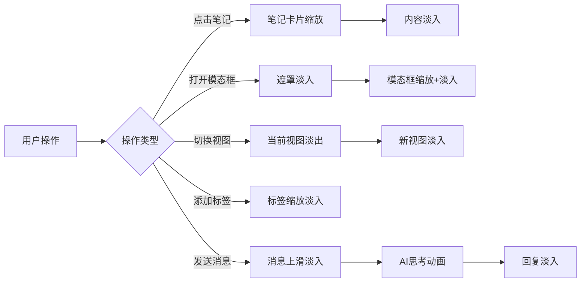

# JD Notes 动画系统优化方案

## 📋 项目概述

JD Notes 是一个基于 React + Tauri 的桌面笔记应用，当前已有基础的 CSS 动画。本方案旨在通过引入现代动画库和优化现有动画，提升用户体验的流畅度和愉悦感。

---

## 🎯 当前动画现状分析

### ✅ 已实现的动画

1. **AI 相关动画**（表现良好）
   - AI 进度条动画（`ai-progress`）
   - AI 内容淡入动画（`ai-fade-in`）
   - AI 菜单出现动画（`ai-menu-appear`）
   - AI Ghost Writing 样式
   - AI 思考中的跳动点动画（`ai-dot-bounce`）
   - AI 流式光标闪烁（`ai-cursor-blink`）

2. **基础交互动画**
   - 按钮点击效果（`btn-press`）
   - 过渡效果（`transition-colors`, `transition-all`）
   - 滚动条样式

3. **侧栏动画**
   - AI 聊天侧栏滑入（`ai-sidebar-slide-in`）
   - 编辑消息淡入（`edit-fade-in`）

### ⚠️ 缺失或需要优化的动画

1. **列表动画**
   - ❌ 笔记卡片缺少进入/退出动画
   - ❌ 列表项切换无过渡效果
   - ❌ 拖拽排序无动画反馈

2. **模态框动画**
   - ⚠️ 设置模态框、命令面板缺少流畅的进入/退出动画
   - ⚠️ 遮罩层淡入效果不够明显

3. **页面切换**
   - ❌ 视图切换（inbox/favorites/trash/calendar）无过渡
   - ❌ 笔记内容切换无淡入淡出

4. **加载状态**
   - ❌ 缺少骨架屏
   - ❌ 数据加载无过渡状态

5. **微交互**
   - ⚠️ 输入框聚焦效果较弱
   - ⚠️ 标签添加/删除无动画
   - ❌ Toast 通知缺少动画

---

## 🔧 动画库选择方案

### 方案对比

| 方案 | 优点 | 缺点 | 推荐度 |
|------|------|------|--------|
| **Framer Motion** | 功能强大、生态完善、文档详细 | 包体积较大（~60KB） | ⭐⭐⭐⭐⭐ |
| **React Spring** | 基于物理的动画、性能好 | 学习曲线陡峭 | ⭐⭐⭐⭐ |
| **Reactbits** | 轻量级、现代化组件 | 生态较小、文档较少 | ⭐⭐⭐ |
| **原生 CSS + Tailwind** | 零依赖、性能最优 | 复杂动画难实现 | ⭐⭐⭐⭐ |
| **混合方案** | 灵活、按需选择 | 需要维护多套方案 | ⭐⭐⭐⭐⭐ |

### 🎯 推荐方案：**Framer Motion + 原生 CSS 混合**

**理由：**
1. **Framer Motion** 适合复杂交互（列表动画、页面切换、手势）
2. **原生 CSS** 适合简单过渡（颜色、透明度、简单变换）
3. 项目已使用 Tailwind CSS，可充分利用其动画工具类
4. 桌面应用对包体积不敏感，可以使用功能更强的库

**关于 Reactbits：**
- Reactbits 是一个较新的库，提供现代化的 React 组件
- 适合快速原型开发，但生态和文档不如 Framer Motion 成熟
- 可以参考其设计理念，但不建议作为主要动画方案

---

## 🎨 详细动画设计方案

### 1. 列表项动画（笔记卡片）

#### 使用 Framer Motion 实现

```tsx
// src/components/common/NoteCard.tsx
import { motion } from 'framer-motion'

export function NoteCard({ note, active, onClick, ... }: NoteCardProps) {
  return (
    <motion.div
      layout // 自动处理布局变化
      initial={{ opacity: 0, y: 20 }}
      animate={{ opacity: 1, y: 0 }}
      exit={{ opacity: 0, x: -20 }}
      transition={{ duration: 0.2, ease: 'easeOut' }}
      whileHover={{ scale: 1.01 }}
      whileTap={{ scale: 0.99 }}
      className={`note-list-item ...`}
      onClick={onClick}
    >
      {/* 内容 */}
    </motion.div>
  )
}
```

#### 列表容器配置

```tsx
// src/components/layout/NoteList.tsx
import { motion, AnimatePresence } from 'framer-motion'

export function NoteList({ notes, ... }: NoteListProps) {
  return (
    <div className="flex-1 overflow-y-auto">
      <AnimatePresence mode="popLayout">
        {notes.map((note) => (
          <NoteCard key={note.id} note={note} ... />
        ))}
      </AnimatePresence>
    </div>
  )
}
```

**效果：**
- ✨ 笔记卡片淡入 + 上滑进入
- ✨ 删除时淡出 + 左滑退出
- ✨ 悬停时轻微放大
- ✨ 点击时轻微缩小
- ✨ 布局变化自动过渡

---

### 2. 模态框动画

#### 设置模态框优化

```tsx
// src/components/modals/SettingsModal.tsx
import { motion, AnimatePresence } from 'framer-motion'

export function SettingsModal({ open, onClose }: SettingsModalProps) {
  return (
    <AnimatePresence>
      {open && (
        <div className="fixed inset-0 z-50 flex items-center justify-center">
          {/* 遮罩层动画 */}
          <motion.div
            initial={{ opacity: 0 }}
            animate={{ opacity: 1 }}
            exit={{ opacity: 0 }}
            transition={{ duration: 0.2 }}
            className="fixed inset-0 bg-black/50 backdrop-blur-sm"
            onClick={onClose}
          />

          {/* 模态框动画 */}
          <motion.div
            initial={{ opacity: 0, scale: 0.95, y: 20 }}
            animate={{ opacity: 1, scale: 1, y: 0 }}
            exit={{ opacity: 0, scale: 0.95, y: 20 }}
            transition={{ duration: 0.2, ease: 'easeOut' }}
            className="relative z-10 w-full max-w-md ..."
          >
            {/* 内容 */}
          </motion.div>
        </div>
      )}
    </AnimatePresence>
  )
}
```

**效果：**
- ✨ 遮罩层淡入
- ✨ 模态框从下方淡入 + 缩放
- ✨ 退出时反向动画

---

### 3. 命令面板动画

```tsx
// src/components/modals/CommandMenu.tsx
import { motion, AnimatePresence } from 'framer-motion'

export function CommandMenu({ open, ... }: CommandMenuProps) {
  return (
    <AnimatePresence>
      {open && (
        <div className="fixed inset-0 z-50">
          {/* 遮罩层 */}
          <motion.div
            initial={{ opacity: 0 }}
            animate={{ opacity: 1 }}
            exit={{ opacity: 0 }}
            className="fixed inset-0 bg-black/40 backdrop-blur-sm"
            onClick={() => setOpen(false)}
          />

          {/* 命令面板 */}
          <motion.div
            initial={{ opacity: 0, y: -20 }}
            animate={{ opacity: 1, y: 0 }}
            exit={{ opacity: 0, y: -20 }}
            transition={{ duration: 0.15, ease: 'easeOut' }}
            className="fixed left-1/2 top-[20%] -translate-x-1/2 ..."
          >
            <Command>
              {/* 内容 */}
            </Command>
          </motion.div>
        </div>
      )}
    </AnimatePresence>
  )
}
```

**效果：**
- ✨ 从上方滑入
- ✨ 快速响应（150ms）

---

### 4. 页面/视图切换动画

```tsx
// src/App.tsx
import { motion, AnimatePresence } from 'framer-motion'

function App() {
  return (
    <div className="h-screen w-screen flex overflow-hidden ...">
      <Sidebar ... />

      <AnimatePresence mode="wait">
        {currentView === 'calendar' ? (
          <motion.div
            key="calendar"
            initial={{ opacity: 0, x: 20 }}
            animate={{ opacity: 1, x: 0 }}
            exit={{ opacity: 0, x: -20 }}
            transition={{ duration: 0.2 }}
            className="flex-1 h-full overflow-hidden"
          >
            <CalendarView ... />
          </motion.div>
        ) : (
          <motion.div
            key="notes"
            initial={{ opacity: 0, x: 20 }}
            animate={{ opacity: 1, x: 0 }}
            exit={{ opacity: 0, x: -20 }}
            transition={{ duration: 0.2 }}
            className="flex-1 flex h-full overflow-hidden"
          >
            <NoteList ... />
            <MainContent ... />
          </motion.div>
        )}
      </AnimatePresence>
    </div>
  )
}
```

**效果：**
- ✨ 视图切换时淡入淡出 + 水平滑动
- ✨ 等待前一个视图退出后再进入新视图

---

### 5. 笔记内容切换动画

```tsx
// src/components/layout/MainContent.tsx
import { motion, AnimatePresence } from 'framer-motion'

export function MainContent({ activeNoteId, ... }: MainContentProps) {
  return (
    <div className="flex-1 flex flex-col ...">
      <AnimatePresence mode="wait">
        {activeNote ? (
          <motion.div
            key={activeNoteId}
            initial={{ opacity: 0, y: 10 }}
            animate={{ opacity: 1, y: 0 }}
            exit={{ opacity: 0, y: -10 }}
            transition={{ duration: 0.15 }}
            className="flex-1 flex flex-col"
          >
            <EditorHeader ... />
            <Editor ... />
          </motion.div>
        ) : (
          <motion.div
            key="empty"
            initial={{ opacity: 0 }}
            animate={{ opacity: 1 }}
            exit={{ opacity: 0 }}
          >
            <EmptyState ... />
          </motion.div>
        )}
      </AnimatePresence>
    </div>
  )
}
```

**效果：**
- ✨ 切换笔记时内容淡入淡出
- ✨ 轻微的垂直位移增强层次感

---

### 6. 标签输入动画

```tsx
// src/components/common/TagsInput.tsx
import { motion, AnimatePresence } from 'framer-motion'

export function TagsInput({ tags, ... }: TagsInputProps) {
  return (
    <div className="flex flex-wrap gap-1.5">
      <AnimatePresence>
        {tags.map((tag) => (
          <motion.span
            key={tag}
            initial={{ opacity: 0, scale: 0.8 }}
            animate={{ opacity: 1, scale: 1 }}
            exit={{ opacity: 0, scale: 0.8 }}
            transition={{ duration: 0.15 }}
            className="px-2 py-1 bg-gray-100 ..."
          >
            {tag}
            <button onClick={() => onRemove(tag)}>×</button>
          </motion.span>
        ))}
      </AnimatePresence>
    </div>
  )
}
```

**效果：**
- ✨ 标签添加时缩放淡入
- ✨ 标签删除时缩放淡出

---

### 7. 骨架屏加载动画

#### 创建骨架屏组件

```tsx
// src/components/common/Skeleton.tsx
import { motion } from 'framer-motion'

export function Skeleton({ className = '' }: { className?: string }) {
  return (
    <motion.div
      className={`bg-gray-200 dark:bg-gray-700 rounded ${className}`}
      animate={{
        opacity: [0.5, 1, 0.5],
      }}
      transition={{
        duration: 1.5,
        repeat: Infinity,
        ease: 'easeInOut',
      }}
    />
  )
}

export function NoteCardSkeleton() {
  return (
    <div className="px-3 py-3 border-b border-black/[0.03]">
      <Skeleton className="h-4 w-3/4 mb-2" />
      <Skeleton className="h-3 w-full mb-1" />
      <Skeleton className="h-3 w-2/3" />
    </div>
  )
}
```

#### 使用骨架屏

```tsx
// src/components/layout/NoteList.tsx
export function NoteList({ notes, isLoading, ... }: NoteListProps) {
  return (
    <div className="flex-1 overflow-y-auto">
      {isLoading ? (
        <>
          <NoteCardSkeleton />
          <NoteCardSkeleton />
          <NoteCardSkeleton />
        </>
      ) : (
        <AnimatePresence mode="popLayout">
          {notes.map((note) => (
            <NoteCard key={note.id} note={note} ... />
          ))}
        </AnimatePresence>
      )}
    </div>
  )
}
```

**效果：**
- ✨ 加载时显示脉动的骨架屏
- ✨ 数据加载完成后平滑过渡到实际内容

---

### 8. Toast 通知动画

#### 创建 Toast 组件

```tsx
// src/components/common/Toast.tsx
import { motion, AnimatePresence } from 'framer-motion'
import { CheckCircle, AlertCircle, X } from 'lucide-react'

interface ToastProps {
  message: string
  type: 'success' | 'error' | 'info'
  onClose: () => void
}

export function Toast({ message, type, onClose }: ToastProps) {
  return (
    <motion.div
      initial={{ opacity: 0, y: -50, scale: 0.9 }}
      animate={{ opacity: 1, y: 0, scale: 1 }}
      exit={{ opacity: 0, y: -20, scale: 0.95 }}
      transition={{ duration: 0.2, ease: 'easeOut' }}
      className={`
        fixed top-4 right-4 z-50 px-4 py-3 rounded-lg shadow-lg
        flex items-center gap-3 min-w-[300px] max-w-md
        ${type === 'success' ? 'bg-green-500 text-white' : ''}
        ${type === 'error' ? 'bg-red-500 text-white' : ''}
        ${type === 'info' ? 'bg-blue-500 text-white' : ''}
      `}
    >
      {type === 'success' && <CheckCircle className="h-5 w-5" />}
      {type === 'error' && <AlertCircle className="h-5 w-5" />}
      <span className="flex-1 text-sm">{message}</span>
      <button onClick={onClose} className="p-1 hover:bg-white/20 rounded">
        <X className="h-4 w-4" />
      </button>
    </motion.div>
  )
}

// Toast 容器
export function ToastContainer({ toasts }: { toasts: Toast[] }) {
  return (
    <AnimatePresence>
      {toasts.map((toast) => (
        <Toast key={toast.id} {...toast} />
      ))}
    </AnimatePresence>
  )
}
```

**效果：**
- ✨ 从顶部滑入 + 缩放
- ✨ 自动消失或手动关闭
- ✨ 多个 Toast 堆叠显示

---

### 9. 微交互优化

#### 输入框聚焦动画（CSS）

```css
/* src/index.css */

/* 输入框聚焦效果 */
.input-focus {
  @apply transition-all duration-200;
}

.input-focus:focus {
  @apply ring-2 ring-[#5E6AD2] ring-offset-2;
  transform: scale(1.01);
}

/* 按钮悬停效果 */
.btn-hover {
  @apply transition-all duration-200;
}

.btn-hover:hover {
  transform: translateY(-1px);
  box-shadow: 0 4px 12px rgba(94, 106, 210, 0.2);
}

.btn-hover:active {
  transform: translateY(0);
}
```

#### 收藏按钮动画

```tsx
// src/components/editor/EditorHeader.tsx
import { motion } from 'framer-motion'

<motion.button
  whileHover={{ scale: 1.1 }}
  whileTap={{ scale: 0.9 }}
  onClick={() => onToggleFavorite(activeNoteId)}
>
  <Star className={activeNote.isFavorite ? 'fill-[#5E6AD2]' : ''} />
</motion.button>
```

**效果：**
- ✨ 悬停时放大
- ✨ 点击时缩小
- ✨ 收藏状态切换时图标填充动画

---

### 10. AI 聊天侧栏优化

#### 消息列表动画

```tsx
// src/components/ai/AIChatSidebar.tsx
import { motion, AnimatePresence } from 'framer-motion'

<div className="space-y-1">
  <AnimatePresence initial={false}>
    {displayMessages.map((msg, index) => (
      <motion.div
        key={msg.id || `temp-${index}`}
        initial={{ opacity: 0, y: 10 }}
        animate={{ opacity: 1, y: 0 }}
        exit={{ opacity: 0, x: -20 }}
        transition={{ duration: 0.2 }}
      >
        <ChatMessageItem message={msg} ... />
      </motion.div>
    ))}
  </AnimatePresence>
</div>
```

**效果：**
- ✨ 新消息从下方淡入
- ✨ 删除消息时向左滑出

---

## 📊 动画性能优化策略

### 1. 使用 CSS Transform 和 Opacity

```tsx
// ✅ 好的做法 - 使用 transform 和 opacity
<motion.div
  animate={{ opacity: 1, x: 0 }}
  transition={{ duration: 0.2 }}
/>

// ❌ 避免 - 使用 width、height、margin 等会触发重排的属性
<motion.div
  animate={{ width: 200, marginLeft: 20 }}
/>
```

### 2. 减少动画持续时间

```tsx
// 桌面应用建议使用较短的动画时间
const transitions = {
  fast: 0.1,      // 100ms - 微交互
  normal: 0.2,    // 200ms - 标准过渡
  slow: 0.3,      // 300ms - 复杂动画
}
```

### 3. 使用 `will-change` 提示浏览器

```css
.animated-element {
  will-change: transform, opacity;
}
```

### 4. 懒加载动画组件

```tsx
// 仅在需要时加载 Framer Motion
import { lazy, Suspense } from 'react'

const AnimatedModal = lazy(() => import('./AnimatedModal'))

<Suspense fallback={<div>Loading...</div>}>
  <AnimatedModal />
</Suspense>
```

### 5. 使用 `AnimatePresence` 的 `mode` 属性

```tsx
// 等待退出动画完成后再进入
<AnimatePresence mode="wait">
  {/* 内容 */}
</AnimatePresence>

// 允许同时进入和退出（列表项）
<AnimatePresence mode="popLayout">
  {/* 内容 */}
</AnimatePresence>
```

### 6. 禁用不必要的动画

```tsx
// 根据用户偏好禁用动画
const prefersReducedMotion = window.matchMedia(
  '(prefers-reduced-motion: reduce)'
).matches

<motion.div
  animate={prefersReducedMotion ? {} : { opacity: 1, y: 0 }}
/>
```

---

## 🎬 动画时序图



---

## 📦 实施步骤

### 阶段一：基础设施（1-2天）

- [ ] 安装 Framer Motion
  ```bash
  pnpm add framer-motion
  ```

- [ ] 创建动画配置文件
  ```tsx
  // src/lib/animations.ts
  export const transitions = {
    fast: { duration: 0.1, ease: 'easeOut' },
    normal: { duration: 0.2, ease: 'easeOut' },
    slow: { duration: 0.3, ease: 'easeOut' },
  }

  export const variants = {
    fadeIn: {
      initial: { opacity: 0 },
      animate: { opacity: 1 },
      exit: { opacity: 0 },
    },
    slideUp: {
      initial: { opacity: 0, y: 20 },
      animate: { opacity: 1, y: 0 },
      exit: { opacity: 0, y: -20 },
    },
    // ... 更多预设
  }
  ```

- [ ] 创建通用动画组件
  ```tsx
  // src/components/common/AnimatedDiv.tsx
  // src/components/common/Skeleton.tsx
  // src/components/common/Toast.tsx
  ```

### 阶段二：核心组件动画（2-3天）

- [ ] 优化笔记卡片动画（NoteCard）
- [ ] 优化模态框动画（SettingsModal、CommandMenu）
- [ ] 添加页面切换动画（App.tsx）
- [ ] 优化笔记内容切换（MainContent）

### 阶段三：交互细节（1-2天）

- [ ] 标签输入动画（TagsInput）
- [ ] 按钮微交互（所有按钮组件）
- [ ] 输入框聚焦效果
- [ ] Toast 通知系统

### 阶段四：加载状态（1天）

- [ ] 创建骨架屏组件
- [ ] 集成到笔记列表
- [ ] 集成到日历视图

### 阶段五：优化与测试（1-2天）

- [ ] 性能测试与优化
- [ ] 无障碍性测试
- [ ] 响应式动画调整
- [ ] 用户偏好支持（减少动画）

---

## 🎨 设计原则

### 1. 一致性
- 所有相似操作使用相同的动画模式
- 统一的动画时长和缓动函数

### 2. 性能优先
- 优先使用 `transform` 和 `opacity`
- 避免在动画中使用会触发重排的属性
- 大列表使用虚拟滚动

### 3. 有意义的动画
- 动画应该传达信息，而不仅仅是装饰
- 引导用户注意力到重要元素

### 4. 快速响应
- 桌面应用动画应该快速（100-300ms）
- 避免过长的动画延迟用户操作

### 5. 可访问性
- 尊重用户的 `prefers-reduced-motion` 设置
- 提供禁用动画的选项

---

## 📈 预期效果

### 用户体验提升
- ✨ 界面更流畅，操作反馈更明确
- ✨ 视觉层次更清晰，引导用户注意力
- ✨ 减少突兀感，提升专业感

### 性能影响
- 📊 包体积增加：~60KB（Framer Motion gzipped）
- 📊 运行时性能：使用 GPU 加速，影响极小
- 📊 内存占用：可忽略不计

### 开发效率
- 🚀 使用 Framer Motion 减少手写动画代码
- 🚀 统一的动画配置便于维护
- 🚀 丰富的预设加速开发

---

## 🔗 参考资源

### Framer Motion
- [官方文档](https://www.framer.com/motion/)
- [动画示例](https://www.framer.com/motion/examples/)
- [性能优化指南](https://www.framer.com/motion/guide-reduce-bundle-size/)

### 设计灵感
- [Linear](https://linear.app/) - 流畅的列表动画
- [Notion](https://notion.so/) - 优雅的页面切换
- [Raycast](https://raycast.com/) - 快速的命令面板

### CSS 动画
- [Tailwind CSS 动画](https://tailwindcss.com/docs/animation)
- [CSS Triggers](https://csstriggers.com/) - 了解哪些属性触发重排

---

## ❓ 常见问题

### Q: Framer Motion 会影响性能吗？
A: 不会。Framer Motion 使用 GPU 加速的 CSS transform 和 opacity，性能影响极小。

### Q: 是否需要完全替换现有的 CSS 动画？
A: 不需要。建议保留简单的 CSS 过渡，仅在复杂场景使用 Framer Motion。

### Q: 如何处理大列表的动画性能？
A: 使用 `AnimatePresence` 的 `mode="popLayout"`，并考虑虚拟滚动。

### Q: 动画会增加多少包体积？
A: Framer Motion gzipped 后约 60KB，对桌面应用影响很小。

---

## 📝 总结

本方案通过引入 **Framer Motion** 和优化现有 CSS 动画，为 JD Notes 提供了一套完整的动画系统。重点优化了：

1. ✅ 列表项进入/退出动画
2. ✅ 模态框和页面切换动画
3. ✅ 微交互和加载状态
4. ✅ 性能优化和可访问性

实施后，应用将拥有更流畅、更专业的用户体验，同时保持良好的性能表现。

---

**下一步：** 是否开始实施此方案？我可以帮你：
1. 安装依赖并配置 Framer Motion
2. 逐步实现各个组件的动画
3. 进行性能测试和优化
