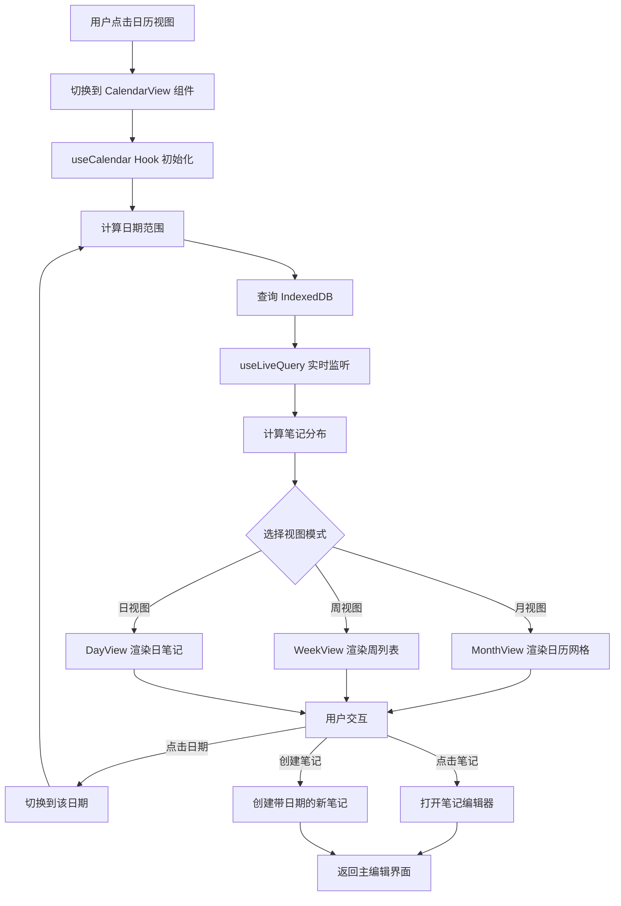

# 日历视图功能设计方案

## 📋 功能概述

为 JD Notes 添加日历视图功能，让用户能够按日期查看和管理笔记，提供时间维度的笔记组织方式。

---

## 🎯 核心功能

### 1. 日历视图模式
- **月视图**：显示整月的笔记分布，每天显示笔记数量
- **周视图**：显示一周的详细笔记列表
- **日视图**：显示单日的所有笔记详情

### 2. 笔记时间维度
- 基于 `createdAt`（创建时间）显示笔记
- 可选切换到 `updatedAt`（修改时间）
- 支持快速跳转到今天、本周、本月

### 3. 交互功能
- 点击日期查看当天的笔记列表
- 日历格子显示笔记数量徽章
- 支持在日历视图中直接创建笔记（自动设置日期）
- 拖拽笔记到不同日期（可选高级功能）

---

## 🏗️ 技术架构

### 数据层

#### 1. 数据库查询优化
当前 `Note` 接口已包含所需字段：
```typescript
interface Note {
  id: number
  title: string
  content: string
  tags: string[]
  isFavorite: number
  isDeleted: number
  createdAt: Date      // ✅ 已有
  updatedAt: Date      // ✅ 已有
}
```

**新增查询方法**（在 `src/lib/db.ts` 中）：
```typescript
export const noteOperations = {
  // ... 现有方法
  
  // 获取指定日期范围的笔记
  async getByDateRange(
    startDate: Date, 
    endDate: Date, 
    dateField: 'createdAt' | 'updatedAt' = 'createdAt'
  ): Promise<Note[]> {
    return await db.notes
      .where(dateField)
      .between(startDate, endDate, true, true)
      .and(note => note.isDeleted === 0)
      .sortBy(dateField)
  },
  
  // 获取指定日期的笔记
  async getByDate(
    date: Date, 
    dateField: 'createdAt' | 'updatedAt' = 'createdAt'
  ): Promise<Note[]> {
    const startOfDay = new Date(date)
    startOfDay.setHours(0, 0, 0, 0)
    
    const endOfDay = new Date(date)
    endOfDay.setHours(23, 59, 59, 999)
    
    return this.getByDateRange(startOfDay, endOfDay, dateField)
  },
  
  // 获取笔记的日期分布统计
  async getDateDistribution(
    startDate: Date,
    endDate: Date,
    dateField: 'createdAt' | 'updatedAt' = 'createdAt'
  ): Promise<Map<string, number>> {
    const notes = await this.getByDateRange(startDate, endDate, dateField)
    const distribution = new Map<string, number>()
    
    notes.forEach(note => {
      const dateKey = formatDateKey(note[dateField])
      distribution.set(dateKey, (distribution.get(dateKey) || 0) + 1)
    })
    
    return distribution
  }
}

// 辅助函数：格式化日期为 YYYY-MM-DD
function formatDateKey(date: Date): string {
  return date.toISOString().split('T')[0]
}
```

#### 2. 自定义 Hook
创建 `src/hooks/useCalendar.ts`：
```typescript
import { useState, useMemo, useCallback } from 'react'
import { useLiveQuery } from 'dexie-react-hooks'
import { db, noteOperations } from '../lib/db'

export type CalendarView = 'month' | 'week' | 'day'
export type DateField = 'createdAt' | 'updatedAt'

export function useCalendar() {
  const [currentDate, setCurrentDate] = useState(new Date())
  const [view, setView] = useState<CalendarView>('month')
  const [dateField, setDateField] = useState<DateField>('createdAt')
  
  // 计算日期范围
  const dateRange = useMemo(() => {
    const start = new Date(currentDate)
    const end = new Date(currentDate)
    
    switch (view) {
      case 'month':
        start.setDate(1)
        start.setHours(0, 0, 0, 0)
        end.setMonth(end.getMonth() + 1, 0)
        end.setHours(23, 59, 59, 999)
        break
      case 'week':
        const day = start.getDay()
        start.setDate(start.getDate() - day)
        start.setHours(0, 0, 0, 0)
        end.setDate(start.getDate() + 6)
        end.setHours(23, 59, 59, 999)
        break
      case 'day':
        start.setHours(0, 0, 0, 0)
        end.setHours(23, 59, 59, 999)
        break
    }
    
    return { start, end }
  }, [currentDate, view])
  
  // 实时查询笔记
  const notes = useLiveQuery(
    async () => {
      return await noteOperations.getByDateRange(
        dateRange.start,
        dateRange.end,
        dateField
      )
    },
    [dateRange.start, dateRange.end, dateField]
  )
  
  // 计算日期分布
  const distribution = useMemo(() => {
    if (!notes) return new Map()
    
    const map = new Map<string, number>()
    notes.forEach(note => {
      const date = note[dateField]
      const key = date.toISOString().split('T')[0]
      map.set(key, (map.get(key) || 0) + 1)
    })
    
    return map
  }, [notes, dateField])
  
  // 导航方法
  const goToToday = useCallback(() => {
    setCurrentDate(new Date())
  }, [])
  
  const goToPrevious = useCallback(() => {
    const newDate = new Date(currentDate)
    switch (view) {
      case 'month':
        newDate.setMonth(newDate.getMonth() - 1)
        break
      case 'week':
        newDate.setDate(newDate.getDate() - 7)
        break
      case 'day':
        newDate.setDate(newDate.getDate() - 1)
        break
    }
    setCurrentDate(newDate)
  }, [currentDate, view])
  
  const goToNext = useCallback(() => {
    const newDate = new Date(currentDate)
    switch (view) {
      case 'month':
        newDate.setMonth(newDate.getMonth() + 1)
        break
      case 'week':
        newDate.setDate(newDate.getDate() + 7)
        break
      case 'day':
        newDate.setDate(newDate.getDate() + 1)
        break
    }
    setCurrentDate(newDate)
  }, [currentDate, view])
  
  const goToDate = useCallback((date: Date) => {
    setCurrentDate(date)
  }, [])
  
  return {
    currentDate,
    view,
    dateField,
    notes,
    distribution,
    dateRange,
    setView,
    setDateField,
    goToToday,
    goToPrevious,
    goToNext,
    goToDate,
  }
}
```

---

## 🎨 UI 组件设计

### 组件结构

```
src/components/calendar/
├── CalendarView.tsx          # 主容器组件
├── CalendarHeader.tsx        # 顶部导航栏
├── MonthView.tsx            # 月视图
├── WeekView.tsx             # 周视图
├── DayView.tsx              # 日视图
├── CalendarGrid.tsx         # 日历网格
├── CalendarCell.tsx         # 单个日期格子
└── index.ts                 # 导出
```

### 1. CalendarView 主组件

```typescript
// src/components/calendar/CalendarView.tsx
import { useState } from 'react'
import { useCalendar } from '../../hooks/useCalendar'
import { CalendarHeader } from './CalendarHeader'
import { MonthView } from './MonthView'
import { WeekView } from './WeekView'
import { DayView } from './DayView'
import type { Note } from '../../lib/db'

interface CalendarViewProps {
  onSelectNote: (note: Note) => void
  onCreateNote: (date?: Date) => void
}

export function CalendarView({ onSelectNote, onCreateNote }: CalendarViewProps) {
  const calendar = useCalendar()
  
  return (
    <div className="h-full flex flex-col bg-[#F9FBFC] dark:bg-[#0B0D11]">
      <CalendarHeader
        currentDate={calendar.currentDate}
        view={calendar.view}
        dateField={calendar.dateField}
        onViewChange={calendar.setView}
        onDateFieldChange={calendar.setDateField}
        onPrevious={calendar.goToPrevious}
        onNext={calendar.goToNext}
        onToday={calendar.goToToday}
      />
      
      <div className="flex-1 overflow-auto">
        {calendar.view === 'month' && (
          <MonthView
            currentDate={calendar.currentDate}
            notes={calendar.notes || []}
            distribution={calendar.distribution}
            onSelectDate={calendar.goToDate}
            onSelectNote={onSelectNote}
            onCreateNote={onCreateNote}
          />
        )}
        
        {calendar.view === 'week' && (
          <WeekView
            currentDate={calendar.currentDate}
            notes={calendar.notes || []}
            onSelectNote={onSelectNote}
            onCreateNote={onCreateNote}
          />
        )}
        
        {calendar.view === 'day' && (
          <DayView
            currentDate={calendar.currentDate}
            notes={calendar.notes || []}
            onSelectNote={onSelectNote}
            onCreateNote={onCreateNote}
          />
        )}
      </div>
    </div>
  )
}
```

### 2. CalendarHeader 导航栏

```typescript
// src/components/calendar/CalendarHeader.tsx
import { ChevronLeft, ChevronRight, Calendar } from 'lucide-react'
import type { CalendarView, DateField } from '../../hooks/useCalendar'

interface CalendarHeaderProps {
  currentDate: Date
  view: CalendarView
  dateField: DateField
  onViewChange: (view: CalendarView) => void
  onDateFieldChange: (field: DateField) => void
  onPrevious: () => void
  onNext: () => void
  onToday: () => void
}

export function CalendarHeader({
  currentDate,
  view,
  dateField,
  onViewChange,
  onDateFieldChange,
  onPrevious,
  onNext,
  onToday,
}: CalendarHeaderProps) {
  const formatTitle = () => {
    const year = currentDate.getFullYear()
    const month = currentDate.getMonth() + 1
    
    switch (view) {
      case 'month':
        return `${year}年${month}月`
      case 'week':
        return `${year}年第${getWeekNumber(currentDate)}周`
      case 'day':
        return `${year}年${month}月${currentDate.getDate()}日`
    }
  }
  
  return (
    <div className="px-6 py-4 border-b border-black/[0.03] dark:border-white/[0.06]">
      <div className="flex items-center justify-between">
        {/* 左侧：标题和导航 */}
        <div className="flex items-center gap-3">
          <Calendar className="h-5 w-5 text-slate-400" strokeWidth={1.5} />
          <h2 className="text-lg font-semibold text-slate-900 dark:text-slate-100">
            {formatTitle()}
          </h2>
          
          <div className="flex items-center gap-1 ml-2">
            <button
              onClick={onPrevious}
              className="p-1.5 rounded-lg text-slate-400 hover:text-slate-900 dark:hover:text-slate-100 hover:bg-black/[0.03] dark:hover:bg-white/[0.06] transition-colors"
            >
              <ChevronLeft className="h-4 w-4" strokeWidth={1.5} />
            </button>
            <button
              onClick={onNext}
              className="p-1.5 rounded-lg text-slate-400 hover:text-slate-900 dark:hover:text-slate-100 hover:bg-black/[0.03] dark:hover:bg-white/[0.06] transition-colors"
            >
              <ChevronRight className="h-4 w-4" strokeWidth={1.5} />
            </button>
            <button
              onClick={onToday}
              className="ml-2 px-3 py-1.5 text-[13px] font-medium text-slate-600 dark:text-slate-400 hover:text-slate-900 dark:hover:text-slate-100 hover:bg-black/[0.03] dark:hover:bg-white/[0.06] rounded-lg transition-colors"
            >
              今天
            </button>
          </div>
        </div>
        
        {/* 右侧：视图切换和时间字段选择 */}
        <div className="flex items-center gap-2">
          {/* 时间字段切换 */}
          <div className="flex items-center gap-1 bg-white/50 dark:bg-white/[0.03] rounded-lg p-1">
            <button
              onClick={() => onDateFieldChange('createdAt')}
              className={`px-3 py-1.5 text-[13px] font-medium rounded-md transition-colors ${
                dateField === 'createdAt'
                  ? 'bg-white dark:bg-white/[0.06] text-slate-900 dark:text-slate-100 shadow-sm'
                  : 'text-slate-500 hover:text-slate-900 dark:hover:text-slate-100'
              }`}
            >
              创建时间
            </button>
            <button
              onClick={() => onDateFieldChange('updatedAt')}
              className={`px-3 py-1.5 text-[13px] font-medium rounded-md transition-colors ${
                dateField === 'updatedAt'
                  ? 'bg-white dark:bg-white/[0.06] text-slate-900 dark:text-slate-100 shadow-sm'
                  : 'text-slate-500 hover:text-slate-900 dark:hover:text-slate-100'
              }`}
            >
              修改时间
            </button>
          </div>
          
          {/* 视图切换 */}
          <div className="flex items-center gap-1 bg-white/50 dark:bg-white/[0.03] rounded-lg p-1">
            <button
              onClick={() => onViewChange('month')}
              className={`px-3 py-1.5 text-[13px] font-medium rounded-md transition-colors ${
                view === 'month'
                  ? 'bg-white dark:bg-white/[0.06] text-slate-900 dark:text-slate-100 shadow-sm'
                  : 'text-slate-500 hover:text-slate-900 dark:hover:text-slate-100'
              }`}
            >
              月
            </button>
            <button
              onClick={() => onViewChange('week')}
              className={`px-3 py-1.5 text-[13px] font-medium rounded-md transition-colors ${
                view === 'week'
                  ? 'bg-white dark:bg-white/[0.06] text-slate-900 dark:text-slate-100 shadow-sm'
                  : 'text-slate-500 hover:text-slate-900 dark:hover:text-slate-100'
              }`}
            >
              周
            </button>
            <button
              onClick={() => onViewChange('day')}
              className={`px-3 py-1.5 text-[13px] font-medium rounded-md transition-colors ${
                view === 'day'
                  ? 'bg-white dark:bg-white/[0.06] text-slate-900 dark:text-slate-100 shadow-sm'
                  : 'text-slate-500 hover:text-slate-900 dark:hover:text-slate-100'
              }`}
            >
              日
            </button>
          </div>
        </div>
      </div>
    </div>
  )
}

function getWeekNumber(date: Date): number {
  const d = new Date(Date.UTC(date.getFullYear(), date.getMonth(), date.getDate()))
  const dayNum = d.getUTCDay() || 7
  d.setUTCDate(d.getUTCDate() + 4 - dayNum)
  const yearStart = new Date(Date.UTC(d.getUTCFullYear(), 0, 1))
  return Math.ceil((((d.getTime() - yearStart.getTime()) / 86400000) + 1) / 7)
}
```

### 3. MonthView 月视图

```typescript
// src/components/calendar/MonthView.tsx
import { useMemo } from 'react'
import { CalendarCell } from './CalendarCell'
import type { Note } from '../../lib/db'

interface MonthViewProps {
  currentDate: Date
  notes: Note[]
  distribution: Map<string, number>
  onSelectDate: (date: Date) => void
  onSelectNote: (note: Note) => void
  onCreateNote: (date?: Date) => void
}

export function MonthView({
  currentDate,
  notes,
  distribution,
  onSelectDate,
  onSelectNote,
  onCreateNote,
}: MonthViewProps) {
  // 生成日历网格数据
  const calendarDays = useMemo(() => {
    const year = currentDate.getFullYear()
    const month = currentDate.getMonth()
    
    // 当月第一天
    const firstDay = new Date(year, month, 1)
    const firstDayOfWeek = firstDay.getDay()
    
    // 当月最后一天
    const lastDay = new Date(year, month + 1, 0)
    const daysInMonth = lastDay.getDate()
    
    // 上月需要显示的天数
    const prevMonthDays = firstDayOfWeek
    const prevMonth = new Date(year, month, 0)
    const prevMonthLastDay = prevMonth.getDate()
    
    // 下月需要显示的天数
    const totalCells = 42 // 6周 x 7天
    const nextMonthDays = totalCells - prevMonthDays - daysInMonth
    
    const days: Array<{
      date: Date
      isCurrentMonth: boolean
      isToday: boolean
      noteCount: number
    }> = []
    
    const today = new Date()
    today.setHours(0, 0, 0, 0)
    
    // 上月
    for (let i = prevMonthDays - 1; i >= 0; i--) {
      const date = new Date(year, month - 1, prevMonthLastDay - i)
      days.push({
        date,
        isCurrentMonth: false,
        isToday: date.getTime() === today.getTime(),
        noteCount: distribution.get(formatDateKey(date)) || 0,
      })
    }
    
    // 当月
    for (let i = 1; i <= daysInMonth; i++) {
      const date = new Date(year, month, i)
      days.push({
        date,
        isCurrentMonth: true,
        isToday: date.getTime() === today.getTime(),
        noteCount: distribution.get(formatDateKey(date)) || 0,
      })
    }
    
    // 下月
    for (let i = 1; i <= nextMonthDays; i++) {
      const date = new Date(year, month + 1, i)
      days.push({
        date,
        isCurrentMonth: false,
        isToday: date.getTime() === today.getTime(),
        noteCount: distribution.get(formatDateKey(date)) || 0,
      })
    }
    
    return days
  }, [currentDate, distribution])
  
  return (
    <div className="p-6">
      {/* 星期标题 */}
      <div className="grid grid-cols-7 gap-2 mb-2">
        {['日', '一', '二', '三', '四', '五', '六'].map((day) => (
          <div
            key={day}
            className="text-center text-[13px] font-medium text-slate-400 py-2"
          >
            {day}
          </div>
        ))}
      </div>
      
      {/* 日历网格 */}
      <div className="grid grid-cols-7 gap-2">
        {calendarDays.map((day, index) => (
          <CalendarCell
            key={index}
            date={day.date}
            isCurrentMonth={day.isCurrentMonth}
            isToday={day.isToday}
            noteCount={day.noteCount}
            onClick={() => onSelectDate(day.date)}
            onCreateNote={() => onCreateNote(day.date)}
          />
        ))}
      </div>
    </div>
  )
}

function formatDateKey(date: Date): string {
  return date.toISOString().split('T')[0]
}
```

### 4. CalendarCell 日期格子

```typescript
// src/components/calendar/CalendarCell.tsx
import { Plus } from 'lucide-react'

interface CalendarCellProps {
  date: Date
  isCurrentMonth: boolean
  isToday: boolean
  noteCount: number
  onClick: () => void
  onCreateNote: () => void
}

export function CalendarCell({
  date,
  isCurrentMonth,
  isToday,
  noteCount,
  onClick,
  onCreateNote,
}: CalendarCellProps) {
  return (
    <div
      className={`
        group relative aspect-square rounded-xl border transition-all cursor-pointer
        ${isCurrentMonth 
          ? 'bg-white dark:bg-white/[0.03] border-black/[0.06] dark:border-white/[0.06]' 
          : 'bg-slate-50 dark:bg-white/[0.01] border-transparent'
        }
        ${isToday 
          ? 'ring-2 ring-[#5E6AD2] ring-offset-2 dark:ring-offset-[#0B0D11]' 
          : ''
        }
        hover:border-[#5E6AD2]/30 hover:shadow-sm
      `}
      onClick={onClick}
    >
      {/* 日期数字 */}
      <div className="absolute top-2 left-2">
        <span
          className={`
            text-sm font-medium
            ${isCurrentMonth 
              ? 'text-slate-900 dark:text-slate-100' 
              : 'text-slate-400 dark:text-slate-600'
            }
            ${isToday ? 'text-[#5E6AD2]' : ''}
          `}
        >
          {date.getDate()}
        </span>
      </div>
      
      {/* 笔记数量徽章 */}
      {noteCount > 0 && (
        <div className="absolute top-2 right-2">
          <span className="inline-flex items-center justify-center min-w-[20px] h-5 px-1.5 text-[11px] font-medium text-white bg-[#5E6AD2] rounded-full">
            {noteCount}
          </span>
        </div>
      )}
      
      {/* 快速创建按钮（hover显示） */}
      {isCurrentMonth && (
        <button
          onClick={(e) => {
            e.stopPropagation()
            onCreateNote()
          }}
          className="absolute bottom-2 right-2 opacity-0 group-hover:opacity-100 transition-opacity p-1 rounded-md bg-[#5E6AD2]/10 hover:bg-[#5E6AD2]/20 text-[#5E6AD2]"
          title="创建笔记"
        >
          <Plus className="h-3 w-3" strokeWidth={2} />
        </button>
      )}
      
      {/* 笔记指示点（最多显示3个） */}
      {noteCount > 0 && noteCount <= 3 && (
        <div className="absolute bottom-2 left-2 flex gap-1">
          {Array.from({ length: Math.min(noteCount, 3) }).map((_, i) => (
            <div
              key={i}
              className="w-1.5 h-1.5 rounded-full bg-[#5E6AD2]/60"
            />
          ))}
        </div>
      )}
    </div>
  )
}
```

### 5. WeekView 周视图

```typescript
// src/components/calendar/WeekView.tsx
import { useMemo } from 'react'
import { formatTime } from '../../lib/utils'
import type { Note } from '../../lib/db'

interface WeekViewProps {
  currentDate: Date
  notes: Note[]
  onSelectNote: (note: Note) => void
  onCreateNote: (date?: Date) => void
}

export function WeekView({
  currentDate,
  notes,
  onSelectNote,
  onCreateNote,
}: WeekViewProps) {
  // 生成一周的日期
  const weekDays = useMemo(() => {
    const days: Date[] = []
    const startOfWeek = new Date(currentDate)
    const dayOfWeek = startOfWeek.getDay()
    startOfWeek.setDate(startOfWeek.getDate() - dayOfWeek)
    
    for (let i = 0; i < 7; i++) {
      const date = new Date(startOfWeek)
      date.setDate(date.getDate() + i)
      days.push(date)
    }
    
    return days
  }, [currentDate])
  
  // 按日期分组笔记
  const notesByDay = useMemo(() => {
    const map = new Map<string, Note[]>()
    
    notes.forEach(note => {
      const dateKey = note.createdAt.toISOString().split('T')[0]
      if (!map.has(dateKey)) {
        map.set(dateKey, [])
      }
      map.get(dateKey)!.push(note)
    })
    
    return map
  }, [notes])
  
  const today = new Date()
  today.setHours(0, 0, 0, 0)
  
  return (
    <div className="p-6">
      <div className="grid grid-cols-7 gap-4">
        {weekDays.map((date) => {
          const dateKey = date.toISOString().split('T')[0]
          const dayNotes = notesByDay.get(dateKey) || []
          const isToday = date.getTime() === today.getTime()
          
          return (
            <div
              key={dateKey}
              className={`
                rounded-xl border p-4
                ${isToday 
                  ? 'bg-[#5E6AD2]/5 border-[#5E6AD2]/30' 
                  : 'bg-white dark:bg-white/[0.03] border-black/[0.06] dark:border-white/[0.06]'
                }
              `}
            >
              {/* 日期标题 */}
              <div className="mb-3 pb-3 border-b border-black/[0.06] dark:border-white/[0.06]">
                <div className="text-[11px] text-slate-400 mb-1">
                  {['周日', '周一', '周二', '周三', '周四', '周五', '周六'][date.getDay()]}
                </div>
                <div className={`text-lg font-semibold ${isToday ? 'text-[#5E6AD2]' : 'text-slate-900 dark:text-slate-100'}`}>
                  {date.getDate()}
                </div>
              </div>
              
              {/* 笔记列表 */}
              <div className="space-y-2">
                {dayNotes.map((note) => (
                  <button
                    key={note.id}
                    onClick={() => onSelectNote(note)}
                    className="w-full text-left p-2 rounded-lg bg-slate-50 dark:bg-white/[0.03] hover:bg-slate-100 dark:hover:bg-white/[0.06] transition-colors"
                  >
                    <div className="text-[13px] font-medium text-slate-900 dark:text-slate-100 truncate">
                      {note.title || '无标题'}
                    </div>
                    <div className="text-[11px] text-slate-400 mt-1">
                      {formatTime(note.createdAt)}
                    </div>
                  </button>
                ))}
                
                {/* 空状态 */}
                {dayNotes.length === 0 && (
                  <div className="text-[13px] text-slate-400 text-center py-4">
                    暂无笔记
                  </div>
                )}
              </div>
              
              {/* 创建按钮 */}
              <button
                onClick={() => onCreateNote(date)}
                className="w-full mt-3 py-2 text-[13px] text-slate-500 hover:text-[#5E6AD2] hover:bg-[#5E6AD2]/5 rounded-lg transition-colors"
              >
                + 创建笔记
              </button>
            </div>
          )
        })}
      </div>
    </div>
  )
}
```

### 6. DayView 日视图

```typescript
// src/components/calendar/DayView.tsx
import { Clock } from 'lucide-react'
import { formatTime } from '../../lib/utils'
import type { Note } from '../../lib/db'

interface DayViewProps {
  currentDate: Date
  notes: Note[]
  onSelectNote: (note: Note) => void
  onCreateNote: (date?: Date) => void
}

export function DayView({
  currentDate,
  notes,
  onSelectNote,
  onCreateNote,
}: DayViewProps) {
  const today = new Date()
  today.setHours(0, 0, 0, 0)
  const isToday = currentDate.getTime() === today.getTime()
  
  return (
    <div className="max-w-4xl mx-auto p-6">
      {/* 日期标题 */}
      <div className={`mb-6 p-6 rounded-2xl border ${
        isToday
          ? 'bg-[#5E6AD2]/5 border-[#5E6AD2]/30'
          : 'bg-white dark:bg-white/[0.03] border-black/[0.06] dark:border-white/[0.06]'
      }`}>
        <div className="flex items-center justify-between">
          <div>
            <div className="text-sm text-slate-400 mb-1">
              {['星期日', '星期一', '星期二', '星期三', '星期四', '星期五', '星期六'][currentDate.getDay()]}
            </div>
            <div className={`text-3xl font-bold ${isToday ? 'text-[#5E6AD2]' : 'text-slate-900 dark:text-slate-100'}`}>
              {currentDate.getMonth() + 1}月{currentDate.getDate()}日
            </div>
          </div>
          <div className="text-right">
            <div className="text-sm text-slate-400 mb-1">共 {notes.length} 篇笔记</div>
            <button
              onClick={() => onCreateNote(currentDate)}
              className="px-4 py-2 text-sm font-medium text-white bg-[#5E6AD2] hover:bg-[#5E6AD2]/90 rounded-lg transition-colors"
            >
              + 创建笔记
            </button>
          </div>
        </div>
      </div>
      
      {/* 笔记列表 */}
      {notes.length > 0 ? (
        <div className="space-y-3">
          {notes.map((note) => (
            <button
              key={note.id}
              onClick={() => onSelectNote(note)}
              className="w-full text-left p-4 rounded-xl bg-white dark:bg-white/[0.03] border border-black/[0.06] dark:border-white/[0.06] hover:border-[#5E6AD2]/30 hover:shadow-sm transition-all"
            >
              <div className="flex items-start justify-between gap-4">
                <div className="flex-1 min-w-0">
                  <h3 className="text-base font-semibold text-slate-900 dark:text-slate-100 mb-2">
                    {note.title || '无标题'}
                  </h3>
                  {note.content && (
                    <p className="text-sm text-slate-500 line-clamp-2">
                      {note.content.replace(/<[^>]*>/g, '').substring(0, 150)}
                    </p>
                  )}
                  <div className="flex items-center gap-3 mt-3">
                    <div className="flex items-center gap-1 text-xs text-slate-400">
                      <Clock className="h-3 w-3" strokeWidth={1.5} />
                      {formatTime(note.createdAt)}
                    </div>
                    {note.tags && note.tags.length > 0 && (
                      <div className="flex items-center gap-1">
                        {note.tags.slice(0, 3).map((tag) => (
                          <span
                            key={tag}
                            className="px-2 py-0.5 text-xs text-slate-600 dark:text-slate-400 bg-slate-100 dark:bg-white/[0.06] rounded"
                          >
                            {tag}
                          </span>
                        ))}
                      </div>
                    )}
                  </div>
                </div>
              </div>
            </button>
          ))}
        </div>
      ) : (
        <div className="text-center py-12">
          <div className="text-slate-400 mb-4">这一天还没有笔记</div>
          <button
            onClick={() => onCreateNote(currentDate)}
            className="px-4 py-2 text-sm font-medium text-[#5E6AD2] hover:bg-[#5E6AD2]/10 rounded-lg transition-colors"
          >
            创建第一篇笔记
          </button>
        </div>
      )}
    </div>
  )
}
```

---

## 🔗 集成到现有应用

### 1. 更新 App.tsx

在 [`src/App.tsx`](src/App.tsx:12) 中添加日历视图支持：

```typescript
// 在 ViewType 中添加 calendar
type ViewType = 'inbox' | 'favorites' | 'trash' | 'calendar' | `tag-${string}`

// 在 App 组件中添加状态
const [showCalendar, setShowCalendar] = useState(false)

// 添加切换日历视图的处理
const handleViewChange = (view: ViewType) => {
  setCurrentView(view)
  setShowCalendar(view === 'calendar')
}

// 在渲染部分，根据 showCalendar 切换显示
{showCalendar ? (
  <CalendarView
    onSelectNote={handleSelectNote}
    onCreateNote={handleCreateNote}
  />
) : (
  <>
    <NoteList ... />
    <MainContent ... />
  </>
)}
```

### 2. 更新 Sidebar 导航

在 [`src/components/layout/Sidebar.tsx`](src/components/layout/Sidebar.tsx) 中添加日历入口：

```typescript
import { Calendar } from 'lucide-react'

// 在导航项中添加
<SidebarItem
  icon={Calendar}
  label="日历"
  isActive={currentView === 'calendar'}
  onClick={() => onViewChange('calendar')}
/>
```

### 3. 导出组件

创建 `src/components/calendar/index.ts`：

```typescript
export { CalendarView } from './CalendarView'
export { CalendarHeader } from './CalendarHeader'
export { MonthView } from './MonthView'
export { WeekView } from './WeekView'
export { DayView } from './DayView'
export { CalendarCell } from './CalendarCell'
```

更新 `src/hooks/index.ts`：

```typescript
export { useCalendar } from './useCalendar'
export type { CalendarView, DateField } from './useCalendar'
```

---

## 📊 实现流程图



---

## ✨ 高级功能（可选）

### 1. 热力图视图

显示笔记活跃度的热力图，类似 GitHub 贡献图：

```typescript
// 在 MonthView 中添加热力图模式
const getHeatColor = (count: number) => {
  if (count === 0) return 'bg-slate-100 dark:bg-white/[0.03]'
  if (count <= 2) return 'bg-[#5E6AD2]/20'
  if (count <= 5) return 'bg-[#5E6AD2]/40'
  if (count <= 10) return 'bg-[#5E6AD2]/60'
  return 'bg-[#5E6AD2]/80'
}
```

### 2. 笔记拖拽

允许用户拖拽笔记到不同日期：

```typescript
// 使用 @dnd-kit 库实现拖拽
import { DndContext, useDraggable, useDroppable } from '@dnd-kit/core'

// 在拖拽结束时更新笔记的 createdAt
const handleDragEnd = async (event) => {
  const { active, over } = event
  if (over) {
    await noteOperations.update(active.id, {
      createdAt: over.data.date
    })
  }
}
```

### 3. 日历导出

导出日历视图为图片或 PDF：

```typescript
import html2canvas from 'html2canvas'
import jsPDF from 'jspdf'

const exportCalendar = async () => {
  const element = document.getElementById('calendar-view')
  const canvas = await html2canvas(element)
  const pdf = new jsPDF()
  pdf.addImage(canvas.toDataURL('image/png'), 'PNG', 0, 0, 210, 297)
  pdf.save('calendar.pdf')
}
```

### 4. 日历提醒

为特定日期设置提醒：

```typescript
// 扩展 Note 接口
interface Note {
  // ... 现有字段
  reminderDate?: Date
  reminderEnabled?: boolean
}

// 使用 Web Notifications API
if (Notification.permission === 'granted') {
  new Notification('笔记提醒', {
    body: note.title,
    icon: '/app-icon.png'
  })
}
```

---

## 🎯 实现优先级

### Phase 1: 核心功能（MVP）
- [x] 数据库查询方法
- [x] useCalendar Hook
- [x] CalendarView 主组件
- [x] CalendarHeader 导航
- [x] MonthView 月视图
- [x] CalendarCell 日期格子
- [x] 集成到 Sidebar

### Phase 2: 增强功能
- [x] WeekView 周视图
- [x] DayView 日视图
- [x] 时间字段切换（创建/修改）
- [x] 快速创建笔记

### Phase 3: 高级功能（可选）
- [ ] 热力图视图
- [ ] 笔记拖拽
- [ ] 日历导出
- [ ] 日历提醒

---

## 🚀 开发建议

1. **先实现月视图**：这是最常用的视图，优先完成
2. **使用现有设计系统**：保持与 JD Notes 的 Linear 风格一致
3. **性能优化**：使用 `useMemo` 缓存计算结果，避免重复渲染
4. **响应式设计**：确保在不同屏幕尺寸下都能良好显示
5. **渐进增强**：先实现基础功能，再逐步添加高级特性

---

## 📝 总结

日历视图功能将为 JD Notes 提供全新的时间维度笔记管理方式，让用户能够：

- 📅 按日期浏览和组织笔记
- 📊 可视化笔记创建活跃度
- ⚡ 快速定位特定日期的笔记
- 🎯 更好地进行时间管理和回顾

该设计方案完全基于现有技术栈，无需引入新的依赖，可以无缝集成到当前应用中。